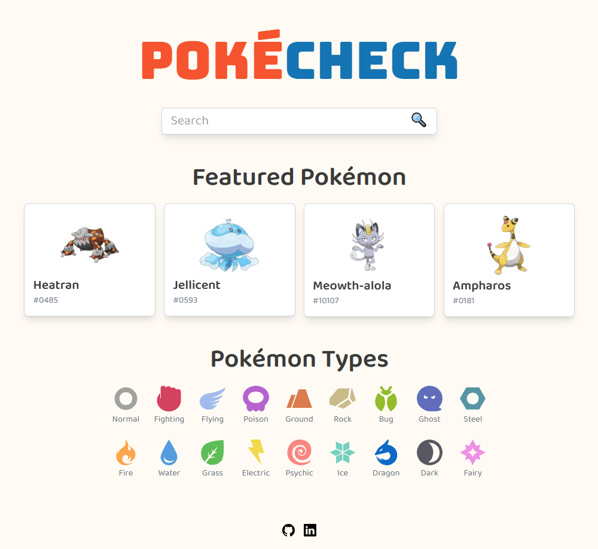

## Overview
PokeCheck is a Pokémon matchup checker that allows users to search for Pokémon and check type effectiveness in battles. The app is designed to be fast, accessible, and user-friendly. For more details, see the [PokeCheck Project Plan](https://github.com/kizuyoko/pokecheck/blob/master/PokeCheck%20Project%20Plan.md).

**Phase 3 is here!**  
In this phase, PokeCheck connects to a dedicated Express.js server for API requests, enhancing performance and scalability. Accessibility has been further improved, and the app is tested end-to-end with Cypress to ensure a smooth user experience. Continuous Integration and Deployment (CI/CD) pipelines via GitHub Actions have also been set up to automate testing and deployment, keeping the project robust and reliable.

**Achievement**
- 100 points on Lighthouse performance for desktop and mobile (homepage & search page)
- 96 points on mobile for the detail page
- Optimized for accessibility and responsive design

## Features
- **Home Page**: Displays featured Pokémon and a search bar.
- **Search Functionality**: Users can search for Pokémon by name.
- **Pokémon Details**: View weight, height, stats, type, and abilities.
- **Type Details**: Check type effectiveness, Pokémon, and move.
- **Favorite Functionality**: Users can add/remove Pokémon to favorites with a heart icon. Favorite list is persisted via localStorage.
- **Favorite List Page**: View all your favorited Pokémon in one place.
- **Responsive Design**: Optimized for both desktop and mobile.

## Tech Stack
- **WireFrame**: [Figma](https://www.figma.com/design/6vT6cOZT5kekdrCWPMHMnK/PokeCheck?node-id=0-1&t=PuoJ8J6K6oqqGOL6-1)
- **Deployment**: [Vercel](https://pokecheck-two.vercel.app/)
- **Framework**: React, Next.js
- **Language**: TypeScript
- **Styling**: Tailwind CSS
- **State Management**: Redux Toolkit
- **API Requests**: Axios, TanStack Query
- **Component Documentation**: Storybook
- **Unit Testing**: Jest
- **E2E Testing**: Cypress
- **Performance Testing**: Lighthouse
- **Version Control**: GitHub (Feature-based branching strategy)

## Getting Started

### Prerequisites
- Node.js (latest LTS version)
- npm or yarn

### Installation
```sh
git clone https://github.com/yourusername/pokecheck.git
cd pokecheck
npm install
```

### Running the App
```sh
npm run dev
```
The app will be available at `http://localhost:3000`.

### Running Tests
```sh
npm test
```
### Running Storybook
```sh
npm run storybook
```

## API Integration
Data is retrieved from the [PokéAPI](https://pokeapi.co).

## Contributing
1. Fork the repository.
2. Create a feature branch: `git checkout -b feature-name`.
3. Commit changes: `git commit -m 'Add new feature'`.
4. Push to branch: `git push origin feature-name`.
5. Submit a pull request.